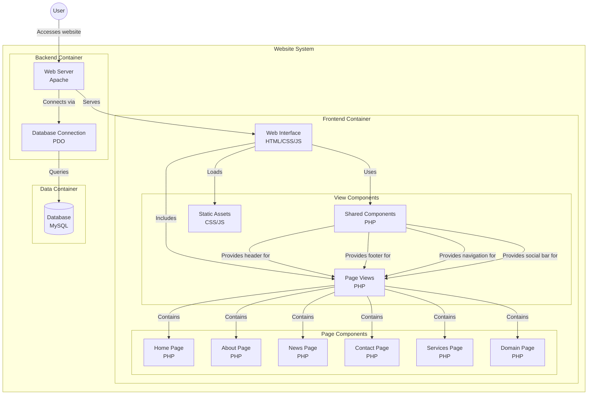

# Project Title: AHDLC 

## Project Structure
```
projet-ahdlc/
├── .htaccess                 # URL rewriting rules
├── config/
│   ├── config.php           # Global configuration
│   └── database.php         # Database connection
├── controllers/
│   ├── HomeController.php
│   ├── AboutController.php
│   ├── NewsController.php
│   ├── DomainController.php
│   ├── ServiceController.php
│   └── ContactController.php
├── models/
│   ├── User.php
│   ├── News.php
│   ├── Service.php
│   └── Contact.php
├── core/
│   ├── App.php             # Application core class
│   ├── Controller.php      # Base controller class
│   ├── Database.php        # Database wrapper class
│   └── Router.php          # URL routing class
├── views/
│   └── Pages view for controllers
├── public/
│   └── index.php           # Entry point
└── README.md


```

## Setup Instructions
1. Clone the repository to your local machine.
2. Navigate to the project directory.
3. Ensure you have a local server environment (like XAMPP or MAMP) set up to run PHP.
4. Place the project folder in the server's root directory (e.g., `htdocs` for XAMPP).
5. Access the project via your web browser at `http://localhost/project-ahdlc`.

## Features
- Responsive design with CSS for various screen sizes.
- Interactive elements powered by JavaScript.
- Organized structure for easy navigation and maintenance.

## Technologies Used
- PHP
- HTML
- CSS
- JavaScript

## License
This project is licensed under the MIT License.